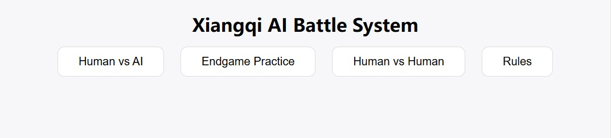
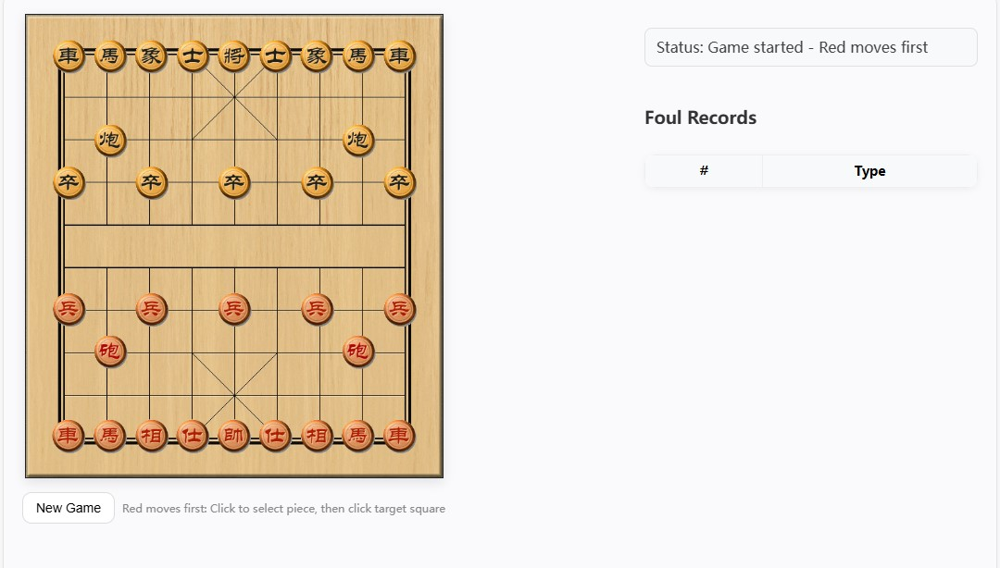
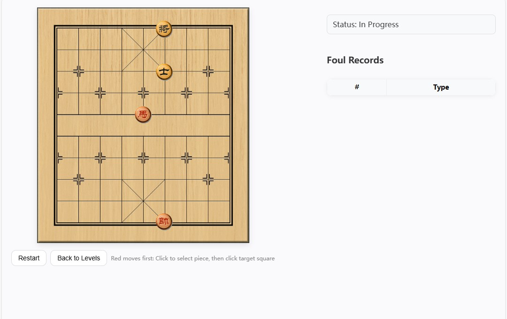

# Chinese Chess Learning System (Xiangqi AI + Interactive Web UI)

A full-stack Chinese Chess (Xiangqi) learning and playing system built with **Spring Boot**, **Java**, **HTML/JS**, and integrated with the **Pikafish Engine** (one of the strongest open-source Xiangqi engines).

This project provides:
- Human vs AI gameplay
- Endgame (puzzle) solving mode
- Illegal-move detection
- Custom position loading
- Game history logging (CSV)
- A complete front-end interactive board with piece images

---

## Features

### **Gameplay Modes**
- **Human vs AI** — Real-time interaction with Pikafish engine  
- **Endgame Mode** — Load preset endgame layouts (1–10 levels)  
- **Custom Setup Mode** — User-configured board positions

### **AI Integration**
- Best move calculation
- AI responds automatically after player move
- Supports variable search depth / difficulty
- Works on any valid position (including endgames)

### **Rule Enforcement**
- Full Chinese Chess rule validation  
- Illegal move detection (no board update)  
- “Check” & “Checkmate” detection  
- Only legal moves allowed  
- Forced protection under check

### **Game Recording**
- Move history table  
- Best move comparison table  
- Illegal move counter  
- All logs saved to CSV for later analysis

### **Front-End UI**
- Click → move system  
- Canvas rendering  
- Highlight last move  
- Display piece icons  
- Smooth animations  
- Responsive layout

### **Project Structure**
src/
└── main/
├── java/com.example.xiangqi/
│ ├── engine/ EngineService.java
│ ├── game/ XqEndgameJudge.java, XqIndividualJuge.java, XqPlayJuge.java, XqRules.java
│ ├── web/ XiangqiApplication.java
│ 
│
├── resources/
│ ├── CSV_Endgame_ZeroShot/endgame_total_steps.csv
│ ├── CSV_Individual_ZeroShot_Red/
│ ├── CSV_Individual_ZeroShot_Black/
│ └── CSV_Xq_ZeroShot/
│ ├── engine/ pikafish.nnue, pikafish-avx2.exe
│
└── static/
├── images/ # Piece & board assets
├── index.html
├── play.html
├── endgame.html
├── individual.html
└── Rules.html

### **Open the Front-End**
http://localhost:8080/index.html

## **Screenshots**

Below are some previews of the system in action:

### Main Menu

### Human vs AI Gameplay

### Endgame Mode

### Move Record & Best Move Comparison

### Board Rendering (Canvas)

